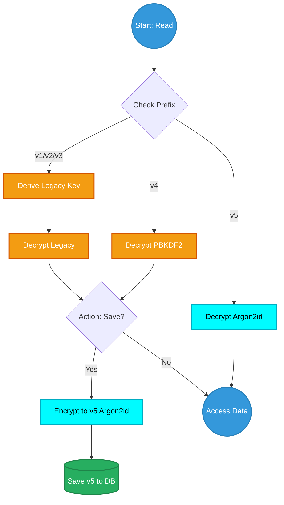
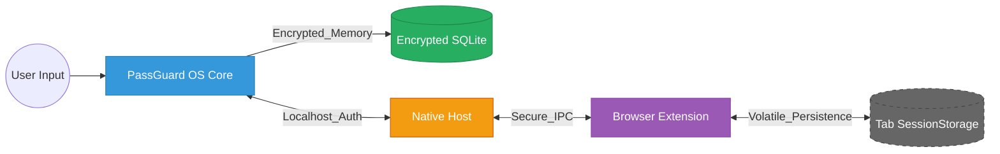

# PassGuard OS


<div align="center">

</div>

**A password manager with advanced encryption, steganography, and panic protocols**


[](https://deepwiki.com/Nooch98/PassGuard-OS)

## 📑 Table of Contents

- [What is PassGuard OS?](#what-is-passguard-os)
    - [Why PassGuard OS?](#why-passguard-os)
- [Features](#features)
    - [Security Features](#security-features)
    - [Password Management](#password-management)
    - [Chrome/Firefox Extension (OPTIONAL)](#chromefirefox-extension-optional)
    - [Backup & Sync](#backup--sync)
    - [Additional Features](#additional-features)
- [Usage](#usage)
    - [First Launch](#first-launch)
    - [Adding a Password](#adding-a-password)
    - [Enabling 2FA](#enabling-2fa)
    - [Device-to-Device Sync (QR)](#device-to-device-sync-qr)
    - [Cold Storage Backup (Steganography)](#cold-storage-backup-steganography)
- [Security](#security)
    - [Encryption Architecture](#encryption-architecture)
    - [Cryptography Details](#cryptography-details)
    - [What PassGuard OS Store & How](#what-passguard-os-store--how)
    - [Security Audit](#security-audit)
    - [Threat Model](#threat-model)
    - [Best Practices](#best-practices)
- [Priority Areas for v1.x](#priority-areas-for-v1x)
- [Disclaimer](#disclaimer)
- [FAQ](#faq)

## What is PassGuard OS?

PassGuard OS is a cross-Platform, offline password manager designed for users who take their digital security seriously. Unlike cloud-based solutions, your data never leaves your devices unless you explicitly export it.

### Why PassGuard OS?

* **✅ Offline-First** - Core vault operations run locally without cloud dependency.
* **✅ Encryption** - AES-256-GCM + Argon2id (v5) for superior GPU/ASIC resistance.
* **✅ Memory Hardness** - Uses 64MB of RAM for key derivation to thwart brute-force attacks.
* **✅ Optimized Memory** - Sensitive data is handled as Uint8List (bytes) to minimize RAM residency and string-pool leaks.
* **✅ Zero Knowledge Architecture** - Master password is never stored in plaintext, Only a PBKDF2 verification hash is stored locally. Biometric unlock stores an encrypted vault key in the OS secure keystore.
* **✅ Browser Integration** - Optional browser extension via secure local bridge
* **✅ Panic Protocol** - Emergency data wipe with biometric trigger
* **✅ Cross-Platform** - Windows, linux, Android
* **✅ Open Source** - Audit the code yourself
* **✅ No Subscriptions** - Free

> [!IMPORTANT]
> PassGuard OS aims to reduce risk through strong local cryptography and offline design, but it is **not professionally security audited** at this time.

## Features

### Security Features
| Feature | Description |
|--- |---
| Argon2id | Memory-hard KDF (64MB, 3 iterations) |
| PBKDF2 | Legacy support with 200,000 iterations for backward compatibility |
| AES-256-GCM | Authenticated encryption for all stored data (Confidentiality + Integrity) |
| Stealth Protocol | Travel Mode: Hide specific sensitive nodes on demand |
| Secure Byte Handling | Use of `Uint8List` instead of `String` for cryptographic operations |
| Biometric Lock | Fingerprint(recomended)/Face ID support (Android) |
| Auto-Lock | Configurable session timeout (1-30 min) |
| Panic Mode | Emergency wipe triggered by password or biometric |
| Screenshot Protection | Prevents screenshots on Android |
| Failed Login Lockout | 5 Attempts = 30-second lockout |
| Entropy Analysis | Shannon Entropy calculation to measure mathematical unpredictability. |
| Isolate Computing | Offloads decryption and audit tasks to a separate CPU thread to prevent memory-sniffing on the main thread during idle. |
| Brute-Force Estimator | Real-time calculation of "Time-to-Crack" based on 100 GH/s attack vectors. |

### Stealth Protocol (Travel Mode)
PassGuard OS implements a **Plausible Deniability** layer through its Stealth Protocol. Unlike standard "Travel Modes" that show only what is marked, our logic is **Inverted for maximum discretion**:

* **Flag to Hide:** You mark specific highly sensitive accounts (Bank, Crypto, Admin) as "Travel Sensitive".
* **One-Tap Vanish:** When Stealth Protocol is activated via the Master Key, all marked accounts are completely de-indexed from the database view.
* **Clean Audit:** The Dashboard automatically recalculates your Health Score ignoring the hidden accounts. To an outside observer (e.g., a border inspection), the vault appears complete and healthy.
* **Secure Deactivation:** Returning to "Full Vault" mode requires a re-validation of your Master Password to prevent unauthorized access if the device is snatched while unlocked.

### Password Health Dashboard

PassGuard OS includes a local password audit dashboard focused on practical vault hygiene.

Current audit capabilities:

- **Weak password detection** based on approximate entropy estimation
- **Password reuse detection** across multiple accounts
- **Known-breach detection** using a local SHA-1 prefix database
- **Keyboard pattern detection** for common sequences such as `qwerty`, `asdfgh`, `zxcvbn`, `123456`, and `qazwsx`
- **Manual exclusion system** for accounts that should be ignored in score calculations
- **Cached results** stored in `audit_cache` for faster reloads
- **Travel Mode-aware auditing**, where hidden travel-sensitive nodes are excluded from the visible report

How the current dashboard works:

- Passwords are decrypted locally during the audit
- Heavy analysis runs in a separate isolate using `compute(...)`
- Approximate entropy is calculated from detected character classes present in each password
- A theoretical offline crack-time estimate is derived using a fixed benchmark of **100 GH/s** (`1e11` guesses/second)
- The final Integrity Index is a penalty-based score derived from the number of accounts with warning/critical findings

> [!IMPORTANT]
> The dashboard is designed for **practical risk ranking**, not formal cryptographic proof.
>
> Entropy values, breach estimates, and crack-time calculations are heuristic and should be interpreted as guidance, not guarantees.


### 🛠️ Custom Breach Database (Optional)

PassGuard OS comes with a standard `breach_db.txt`, but you can generate your own custom threat database using any wordlist (like the full RockYou or specialized leaks).

I provide a Python script in the repository to convert plain-text passwords into the **SHA-1 Prefix** format used by our audit engine.

#### **How to Generate Your Own Database**

1. Place your wordlist (e.g., `rockyou.txt`) in the same folder as the script.
2. Run the generator script:
```python
import hashlib
import os

def generate_breach():
    print("--- PassGuard OS: Breach DB Generator ---")

    path = input("Enter the full path to your wordlist (e.g., C:/data/rockyou.txt): ").strip()

    path = path.replace('"', '').replace("'", "")

    if not os.path.isfile(path):
        print(f"❌ Error: File not found at {path}")
        return

    try:
        limit_str = input("Max entries to process (e.g., 500000) [Enter for ALL]: ").strip()
        limit = int(limit_str) if limit_str else 0
    except ValueError:
        print("❌ Invalid number. Defaulting to ALL.")
        limit = 0

    hashes = set()
    count = 0

    print(f"\nProcessing: {os.path.basename(path)}...")
    
    try:
        with open(path, 'r', encoding='latin-1') as f:
            for line in f:
                password = line.strip()
                if not password: continue
                h = hashlib.sha1(password.encode()).hexdigest()[:10]
                hashes.add(h)
                
                count += 1
                if limit > 0 and count >= limit:
                    break
                
                if count % 100000 == 0:
                    print(f"-> {count} passwords analyzed...")

        print(f"\nWriting {len(hashes)} unique hashes to 'breach_db.txt'...")
        with open('breach_db.txt', 'w') as out:
            for h in sorted(hashes):
                out.write(h + '\n')
                
        print(f"\n✅ SUCCESS!")
        print(f"Final file size: {os.path.getsize('breach_db.txt') / (1024*1024):.2f} MB")
        print("Move 'breach_db.txt' to your project's 'assets/' folder.")
        
    except Exception as e:
        print(f"❌ CRITICAL_ERROR: {e}")

if __name__ == "__main__":
    generate_breach()
```
3. Replace the `assets/breach_db.txt` in the project with your new file and rebuild.
> [!CAUTION]
> **PERFORMANCE WARNING:** The larger the `breach_db.txt`, the more RAM the application will consume during the Security Audit.
>  * **500k entries:** ~5MB (Recommended for mobile/entry-level devices).
>  * **1M+ entries:** May cause significant slowdowns or "Out of Memory" crashes on older Android devices.

### Password Management
* **Advanced Password Generator**
    * Random Passwords (8-64 characters)
    * Memorable passphrases (4-6 words)
    * PIN Codes (4-12 digits)
    * Real-time strength analysis
    * Exclude ambiguous characteres option
* **2FA/TOTP Support**
    * QR code scanning for authenticator codes
    * Real-time TOTP code generation
    * 30-second countdown timer
* **Password Health Dashboard**
    * Weak password detection
    * Reuse detection
    * Old password alerts (90+ days)
    * Overall security score (0-100)
* **Organization Tools**
    * Categories: Personal, Work, Finance, Social
    * Favorites system
    * Search & filter
    * Sort by: Name, Date, Last Used, Favorites
    * Encrypted notes per entry
    * Password history (last 5 changes)
 
### Chrome/Firefox Extension (OPTIONAL)
Optional browser extension via secure local bridge. The extension for **Firefox is officially signed by Mozilla**, ensuring security and seamless installation.

### Smart Auth Engine (v1.2.0)

The extension now features an advanced interception engine designed to handle modern web flows:
* Step-by-Step Support: Uses sessionStorage to persist usernames across multiple pages (e.g., Google login flow).
* Dynamic Linking: Detects if a known account is being used on a new sub-domain/origin and offers instant linking.
* Shadow DOM Discovery: Deep scanning of web elements to find hidden or complex login fields.

>[!CAUTION]
>NATIVE POPUP CONFLICT: Browsers (Chrome, Firefox, Edge) will often trigger their own "Save Password" popup simultaneously.

You must interact with the PassGuard "LINK ACCOUNT" banner quickly. If the browser's native popup is accepted or the page redirects too fast, the extension port may close due to browser bfcache policies.
>[!IMPORTANT]
>Work in progress: fixing interference with native browser popups.

The browser extension allows:
* Autofill login credentials
* Manual password copy
* Lock vault from browser
* It only provides the credentials for that domain.
* Use shortcuts to autofill:
    - Default: `CTRL + SHIFT + L`
    - MacOS: `COMMAND + SHIFT + L`

The extension **never accesses the vault directly**.


Security design:

* The extension cannot read the vault directly.
* All credential requests are validated by the PassGuard OS application.
* Communication occurs only through `localhost` IPC.
* A **bridge authentication token** prevents unauthorized processes from accessing the vault.

https://github.com/user-attachments/assets/7a037229-5e2b-4558-850f-30d6a9c2ad13

The file `com.passguard.os.json` is located in the extension directory.

**com.passguard.os.json for Chrome/Brave/Edge/Opera GX**
```json
{
  "name": "com.passguard.os",
  "description": "PassGuard OS Native Messaging Host",
  "path": "<YOUR PATH TO passguardnativehost.exe>",
  "type": "stdio",
  "allowed_origins": [
    "chrome-extension://<ID-EXTENSION>/"
  ]
}
```
**com.passguard.os.json for Firefox**

If you use the package already signed by Mozilla (recommended), do not modify `allowed_extensions`, only modify the path field.
```json
{
  "name": "com.passguard.os",
  "description": "PassGuard OS Native Messaging Host",
  "path": "<path to native host binary passguardnativehost.exe>",
  "type": "stdio",
  "allowed_extensions": [
    "passguard-os@passguard.com"
  ]
}
```

This manifest must be registered in the system so Chrome can locate the native host.
On Windows the registry key is typically:
```powershell
HKEY_CURRENT_USER\Software\Google\Chrome\NativeMessagingHosts\com.passguard.os
```
pointing to the path of `com.passguard.os.json`.

You can also use the `Register_Extension_windows.ps1` script for Windows by providing the path to the `com.passguard.os.json` file when prompted, and it will be added automatically.

### PassGuard NativeHost
You need to extract `passguard_native_host`dir from the PassGuard-OS directory.
If you want to use the Chrome extension, you will need to create the executable with the following command:
```bash
mkdir build
dart compile exe bin/passguard_main.dart -o build/PassGuardNativeHost.exe
```

**Security Note**
The browser extension is designed to minimize exposure of sensitive data:

* The extension never stores credentials
* The vault remains encrypted on disk
* Decryption occurs only during an active session
* Secrets are returned only when requested for the active domain

### Bridge Authentication

The local IPC bridge requires a random authentication token generated by the PassGuard OS application.

• The token is created on first launch  
• Stored locally in the user configuration directory  
• Required for every extension request  

This prevents other local processes from impersonating the browser extension and accessing vault data.

### Linux Native Messaging Setup
For Linux users, the Native Messaging setup requires registering the binary path.

1. **Compile the Native Host**
Navigate to your native host directoy and compile the binary:
```bash
dart compile exe bin/passguard_main.dart -o PassGuardNativeHost
chmod +x PassGuardNativeHost
```

**CHROME BASED BROWSER**

`com.passguard.os.json` format:
```json
{
  "name": "com.passguard.os",
  "description": "PassGuard OS Native Messaging Host",
  "path": "<YOUR PATH TO passguardnativehost>",
  "type": "stdio",
  "allowed_origins": [
    "chrome-extension://<ID-EXTENSION>/"
  ]
}
```

**FIREFOX BRWOSER**

`com.passguard.os.json` format:
```json
{
  "name": "com.passguard.os",
  "description": "PassGuard OS Native Messaging Host",
  "path": "<path to native host binary passguardnativehost>",
  "type": "stdio",
  "allowed_extensions": [
    "passguard-os@passguard.com"
  ]
}
```


2. **Automatic Registration Script**
I provide a bash script(`Register_Extension_Linux.sh`) to handle registration automatically across all major linux browsers:
    1. Download `Register_Extension_Linux.sh`.
    2. Make it executable: `chmod +x Register_Extension_Linux.sh.
    3. Run it
    4. Follow the prompts and select your browser.  

### Backup & Sync
| Method | Capacity | Best For |
|--- |--- |---
| QR Code Sync | Low | Quick device-to-device transfer |
| Steganography | unlimited | Large vaults, covert backups |

**Steganography Feature:** Hide your entire encrypted vault inside an innocent-looking image. Perfect for cloud backup without exposing your data

### Additional Features

* **Recovery Code Manager** - Import & track 2FA backup codes
* **Encrypted File Vault** - Store sensitive documents *(Beta - functional but may have issues)*
* **Smart Clipboard** - Auto-clear after 30 seconds
* **Dark Cyberpunk Theme** - Easy on the eyes
* **Offline-First** - Works without internet

## Usage

### First Launch

1. **First-Time Setup**:
   - Create master password (min 8 characters)
   - Confirm master password
   - Set panic password (different from master)

#### Adding a Password
```
1. Tap + button
2. Select "Add New Password"
3. Fill in details (use generator for strong passwords)
4. Choose category
5. Save
```

#### Enabling 2FA
```
1. Tap + → "Scan QR 2FA"
2. Scan QR code from your service
3. Select account to link
```

#### Device-to-Device Sync (QR)
```
Device A: Settings → Generate Transmission QR
Device B: Settings → Receive Data Stream → Scan QR
```

#### Cold Storage Backup (Steganography)
```
Hide:    Settings → Cold Storage → Inject Into Image
Restore: Settings → Cold Storage → Extract From Image
```

## Security


### Encryption Architecture
```
User Password (Master)
     ↓
Argon2id (64MB RAM, 3 Iterations, 4 Parallelism)
     ↓
256-bit Derived Key (Handled as Bytes)
     ↓
AES-256-GCM Encryption
     ↓
Encrypted SQLite Fields (v5. Prefix)
```
> [!WARNING]
> PassGuard OS encrypts sensitive fields individually instead of encrypting the entire SQLite database file.
> This design allows selective decryption and improves performance while ensuring that all sensitive data remains cryptographically protected.

### Seamless Migration Engine
The following diagram illustrates how the application automatically handles data migration across different encryption versions (v1-v4) on-the-fly:



### Cryptography Details

* Key Derivation: Argon2id
* Memory Cost: 64 MB
* Iterations: 3
* Parallelism: 4  
* Encryption: AES-256-GCM
* Data Handling: Native Byte buffers (`Uint8List`) to prevent "String-in-memory" persistence.
* Random generator: Dart Random.secure() (CSPRNG)

### What PassGuard OS Store & How

| Data Type | Current Storage | Current Protection |
|---|---|---|
| Master Password | Never stored in plaintext | Salted PBKDF2-HMAC-SHA256 verification hash |
| Panic Password | Never stored in plaintext | Salted PBKDF2-HMAC-SHA256 verification hash |
| Account Passwords | SQLite | `v5` AES-256-GCM + Argon2id for new/updated records |
| Notes | SQLite | `v5` AES-256-GCM + Argon2id for new/updated records |
| TOTP Seeds | SQLite | `v5` AES-256-GCM + Argon2id for new/updated records |
| Recovery Codes | SQLite | `v5` AES-256-GCM + Argon2id for new/updated records |
| Audit Cache | SQLite (`audit_cache`) | Cached risk metadata, not a substitute for encrypted secret storage |
| Biometric Unlock Secret | Platform secure storage | Stored through `flutter_secure_storage` / OS keystore mechanisms |

### Security Audit
Before releasing this as v1.0, the following measures were taken:

* Zero hardcoded passwords or keys
* No data leakage to logs
* Secure random number generation
* Memory cleanup on lock
* No vault data or secret material is transmitted to external servers.
* Open source for community audit

>[!IMPORTANT]
> While this app implements strong security practices, it has not been professionally audited. Use at your own discretion.

### Threat Audit Logic

PassGuard OS categorizes risks using a priority-queue logic, ensuring that the most dangerous vulnerabilities are addressed first:

1. 🔴 **CRITICAL: Breach Match**
   * **Finding:** The SHA-1 hash prefix of your password was found in the local `breach_db.txt` (RockYou database).
   * **Risk:** This password has been leaked in past data breaches and is present in every hacker's dictionary. It will be cracked **instantly**.

2. 🔴 **CRITICAL: Key Reuse Detected**
   * **Finding:** The same password is being used across multiple platforms.
   * **Risk:** A single leak on one site grants access to all linked accounts. This is the #1 cause of mass account takeovers.

3. 🔴/🟠 **CRITICAL/WARNING: Computational Crack Time**
   * **Finding:** The system simulates an offline brute-force attack using high-end hardware (100 GH/s GPU performance) to estimate resistance.
   * **Thresholds:**
     * **< 1 Hour (CRITICAL):** Extremely vulnerable. Standard automated tools can guess this password during a lunch break.
     * **< 30 Days (WARNING):** Suboptimal security. While not instant, it is not "future-proof" against modern hardware clusters.
     * **Years / Centuries (SECURE):** Optimal entropy. The password is mathematically robust against current brute-force standards.

4. 🟠 **WARNING: Keyboard Patterns**
   * **Finding:** Detection of predictable sequential patterns (e.g., `qwerty`, `asdfgh`, `123456`).
   * **Risk:** Even if the password is long, brute-force algorithms prioritize these patterns, making them significantly easier to crack than random strings.

> [!TIP]
> **Stealth Logic in Audits:** > When the Stealth Protocol is **ON**, accounts marked as sensitive are excluded from the `TOTAL_NODES` and `HEALTH_SCORE`. This ensures that even if your hidden accounts have weak passwords, they won't lower the visible score, maintaining your "Security Cover".

> [!NOTE]
> **Why am I seeing "Critical" for 8-character passwords?**
> In 2026, an 8-character password—even with symbols—can be cracked in under an hour by a single modern GPU. PassGuard OS uses these aggressive "real-world" hardware benchmarks to ensure your vault stays ahead of current cyber-threats.

### Threat Model
PassGuard OS is a personal project following a Zero-Knowledge and Offline-First model. This threat model defines the security boundaries of the current implementation:

**Mitigated Attack Vectors**

* **Physical Theft**: Protected by full-vault AES-256-GCM encryption + PBKDF2 hashing.
* **Cloud/Network Breaches**: Completely mitigated (No network egress points).
* **Local IPC/Extension Attacks**: Mitigated via per-session authentication tokens and origin validation.
* **Duress/Coercion**: Mitigated via Panic Protocol (immediate destruction of the local vault).
* **Step-by-Step Data Leakage**: Mitigated via **Volatile Session Storage**. When handling multi-page logins (e.g., Google), the username is temporarily stored in the tab's `sessionStorage`. This data is never written to disk, is isolated per tab, and is wiped immediately after the credential set is completed or the tab is closed.
* **Audit Memory Residency:** During a security audit, the vault is decrypted in a temporary Isolate. While this isolate is destroyed after the task, the plain-text passwords exist in RAM for the duration of the scan (usually < 2 seconds).

**Known Limitations**

* **System Compromise**: If the host OS is compromised (Root/Kernel access), the vault must be considered compromised.
* **Memory Forensic Attacks**: While I implement buffer clearing, hardware-level memory forensics while the vault is unlocked remain a risk.
* **Input Interception (Keyloggers)**: Software-based keyloggers on the host OS can capture the Master Password during entry.
* **Advanced Persistent Threats (APTs)**: Designed for personal use, not targeted state-level surveillance.
* **Browser-Level Memory**: While `sessionStorage` is isolated, an attacker with full control over the browser process or a malicious extension with broad permissions could theoretically access the temporary username stored during a multi-step login.



### Best Practices

1. Use a strong, unique master password (16+ chars recommended)
2. Enable biometric unlock for convenience
3. Set session timeout to 5 minutes or less
4. Backup regularly (steganography recommended)
5. Enable 2FA for all accounts that support it
6. Run security audit monthly
7. Never reuse passwords
8. Keep your OS and PassGuard OS updated


### Priority Areas for v1.x
1. **Bug fixes and stability**
2. **iOS support (I dont have any IOS device so i cant test and build)**
3. **Documentation improvements**
4. **Security audit feedback**


## Disclaimer

**PassGuard OS v1.0 - First Public Release**

This software is provided "as is" for personal use and educational purposes.

### What this means:
* Open source and auditable
* No tracking or telemetry
* Industry-standard encryption (AES-256)
* Active development and support

### Important limitations:
* Not professionally security audited
* First public release - may contain bugs
* Use at your own risk
* Not intended for enterprise/commercial use
* Always maintain backups

**No warranty is provided**

## FAQ
<details>
<summary><b>Is my data sent to the cloud?</b></summary>
    <br>
    PassGuard OS is an <i>offline-first</i> application. Your sensitive vault data never leaves your device unless you explicitly export it. 
    <ul>
        <li><b>Privacy Note:</b> The app occasionally fetches website icons (favicons) from external APIs to improve UI. No credential or vault data is involved in these requests.</li>
        <li><b>Extension Bridge:</b> The optional browser extension communicates with the app locally via <i>Native Messaging</i> over <i>localhost</i>.</li>
        <li><b>Vault Security:</b> Crucially, <b>the browser extension never has direct access to your vault</b>. All credential requests are handled exclusively by the PassGuard OS desktop application, which manages the decrypted vault in memory and provides only the requested data for the active domain.</li>
    </ul>
</details>
<details>
<summary><b>What if I forget my master password?</b></summary>
    There is no recovery mechanism by design. If you forget your master password, your data is permanently locked. This is a feature, not a bug - it ensures zero-knowledge security. Always keep backups!
</details>
<details>
<summary><b>Is this safe to use?</b></summary>
<br>
PassGuard OS uses real cryptographic primitives and local-first design principles, but it is not professionally audited and still includes legacy compatibility code and convenience-driven browser integration logic.

The dashboard can help you spot:
<ul>
  <li>reused passwords</li>
  <li>known leaked passwords</li>
  <li>simple keyboard patterns</li>
  <li>low-entropy passwords</li>
</ul>

However, its score and crack-time estimates are heuristic and should be treated as guidance, not guarantees.

For cautious use:
<ul>
  <li>review the code yourself</li>
  <li>start with non-critical secrets</li>
  <li>keep backups</li>
  <li>disable the browser extension if you do not need it</li>
</ul>
</details>
<details>
<summary><b>How do I backup my vault?</b></summary>
    Three methods:
    1. <b>QR Sync</b>: Quick, for small vaults (~25 passwords)
    2. <b>Steganography</b>: Best for large vaults (hide in image)
    3. <b>CSV Export</b>: Universal, but less secure during transfer
</details>
<details>
<summary><b>What's the panic mode for?</b></summary>
    If under duress (border crossing, robbery), use your panic password or hidden biometric button to instantly wipe all vault data. Cannot be undone - ensure you have backups!
</details>

<div align="center">
Thank You for Trying PassGuard OS v1.0!
</div>
